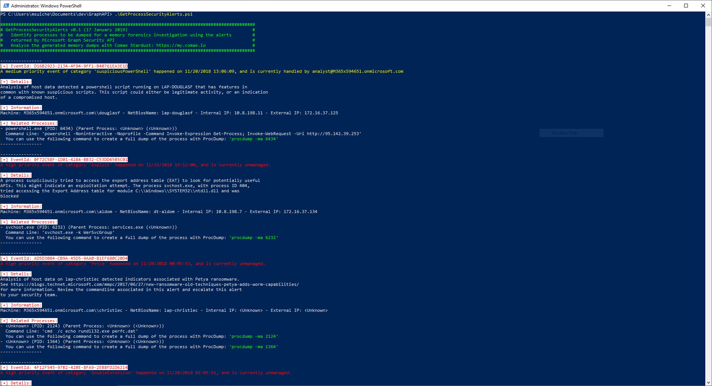

# Getting Started
This folder is a collection of scripts to help analysts and incident responders to leverage alerts generated by endpoint solutions in their network to identify which machines or processes need to be analyzed.

Alerts are great, but often they do not provide enough information which still require manual interaction from an analyst. But guess what, memory forensics is great for that!

Its existance aims also at encouraging vendors to provide a more open interface to enable more reponse scenarios.

# Interfaces
## Microsoft Graph API
`Utils/GraphAPI/GetProcessSecurityAlerts.ps1` contains a script that returns the list of processes identified by Microsoft Graph API.

```powershell
PS Stardust-PowerShell> .\Utils\GraphAPI\GetProcessSecurityAlerts.ps1
```

